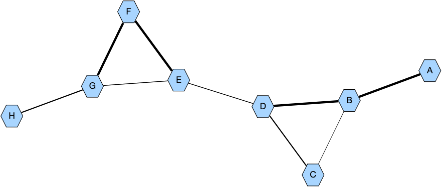
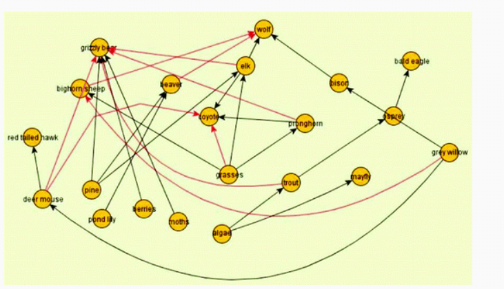
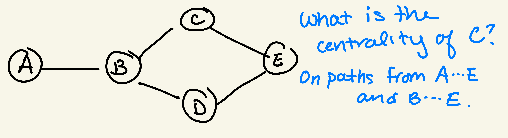
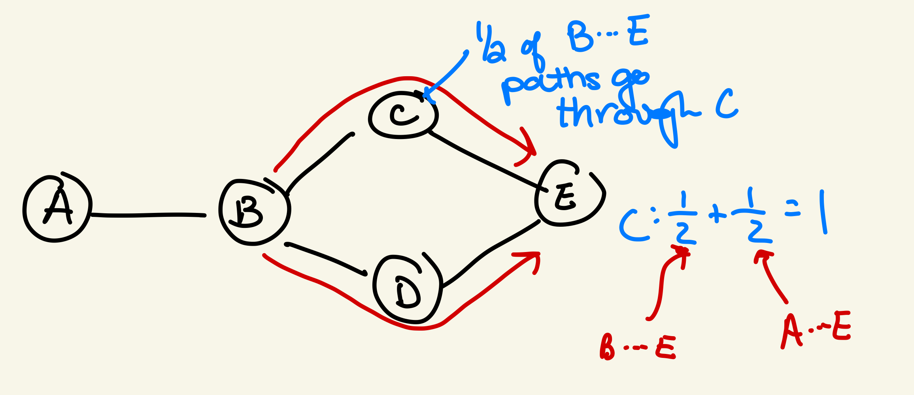

# Betweenness Centralities

In this programming assignment you will calculate the shortest-path betweenness centrality for all nodes on weighted and unweighted (undirected) graphs. A skeleton of the code is provided in `run.py` and there are four functions in `utils.py` that will be helpful.

* **Assignment Out:** Monday, Sept 28
* :arrow_right: _Suggested Deadline:_ Complete Task A by Oct 2
* :arrow_right: _Suggested Deadline:_ Complete Task B by Oct 9
* :arrow_right: _Suggested Deadline:_ Complete Task C by Oct 16 (Oct 2 lecture will review this)
* **Assignment Due:** Monday, Oct 19

Tasks D & E ask you to run your code on different networks, so they shouldn't take long once Tasks A-C are completed.

## **Task A:** Preliminaries

### Post the Example Graph

To begin, we will work on the example graph below. The edges of this graph have an associated _cost_ (either 1, 2, or 3).  The line thicknesses are larger for smaller costs (the thicker the line, the closer the two nodes are).  Node `F` is closer to `G` than `C` is to `B`.



This graph is stored in `example-edges.txt`, which has three columns: nodeA, nodeB, and the cost (treat this number as a float).  The `utils.py` file includes a `read_edges(fname)` function that takes a file name (e.g., `'example-edges.txt'`) and returns **two** dictionaries representing an undirected graph:

1. An adjacency list (a dictionary of (node,neighbor_set) key-value pairs).  For a graph with two edges: A-B and B-C, the adjacency list is:

```
{'A': {'B'}, 'B': {'C', 'A'}, 'C': {'B'}}
```
where `'{'B'}'` is a set containing `'B'`.

2. An edge costs dictionary.  This dictionary contains (node,neighbor_dictionary) key-value pairs.  The neighbor_dictionary is another dictionary that contains (neighbor,cost) key-value pairs.  Suppose in the two-edge graph, A-B has cost 1 and B-C has cost 3.  The edge costs dictionary will be:

```
{'A': {'B': 1}, 'B': {'A': 1, 'C': 3}, 'C': {'B': 3}}
```

This dictionary is useful because `edge_costs['A']['B']` provides the cost of edge A-B. Since the graph is undirected, you can also get this cost with `edge_costs['B']['A']`.  

Print the adjacency list and edge cost dictionary for the example graph to understand these dictionaries.  Then post a graph to GraphSpace that includes the edge costs as line widths (note that there's a `utils.post()` function for you to use).  To replicate the line widths in the figure above, use `1/edge_costs[u][v]*4` so smaller edge costs will be thicker lines.  For nodes `u` and `v`, you can annotate edge style of the GraphSpace object `G` with

```
G.add_edge_style(u,v,width=4/edge_costs[u][v])
```

This line width will work for all networks in this assignment. Ask Anna if you have trouble getting the example graph to look like the figure above.

### Modify `shortest_paths()` function to return the paths

In Lab 3 and the Module 2 Programming Assignment, we wrote a `shortest_paths()` function that returns a dictionary `D` of the path lengths from a node `s` to all other nodes in the graph.  We need to be able to calculate the paths themselves.  

1. Copy the `shortest_paths()` code from Lab 3 into the `unweighted_shortest_paths()` function.

2. Modify the function to include a new  _predecessor_ dictionary `pi`. A node's predecessor is the `exploring` node from which the shortest distance is calculated.  To calculate a path from A to C in the two-edge graph (A-B,B-C), the predecessor dictionary will be:

```
{'A':None,'B':'A','C':'B'}
```

The `pi` dictionary should be updated **every time** the distance dictionary is updated.

Once your code returns a `pi` dictionary, the `utils.py` code has a `get_path()` function, which returns the shortest path from two nodes using the predecessor dictionary. If the predecessor dictionary above is assigned to the variable `pi`, then: `utils.get_path('A','C',pi)` returns `['A','B','C']`.  Run your code on the example graph and manually check that the correct paths are returned.

:question: What if multiple paths are tied for the shortest path? Your code will arbitrarily pick one of those shortest paths, namely whatever was stored in the predecessor dictionary.  See the **Challenge Tasks**.

## :star: **Task B:** Betweenness Centrality for the Unweighted Example Graph

Recall that the shortest-path betweenness centrality for a node _v_ is the total number of shortest paths that go through _v_ from any two nodes in the graph.  The `get_centralities()` function takes three inputs: the `adj_list` and `edge_cost` dictionaries, and a Boolean `weighted` variable that is `True` if the graph is weighted and `False` otherwise.  Begin with the case where `weighted=False`.

You do _not_ want to iterate over each node to calculate the centrality one node at a time - if you do that you would be re-calculating the shortest paths between the same pairs of nodes over and over. Instead, you want to loop through all pairs of nodes (much like all pairs shortest paths code from Module 2 Programming Assignment), and update a `centralities` dictionary.  This dictionary will be updated for any node that is on a path but is not a start or end.  For the two-edge graph, the final centralities will be:

```
{'A':0,'B':1,'C':0}  
```

because `B` lies on the shortest path between `A` and `C` (namely, `['A','B','C']`). Other shortest paths (e,g, `['A','B']` or `['B','C']`) don't have a node _between_ a pair of nodes.  Remember that you have the `utils.get_path()` functon to return the shortest path between nodes.

When you have calculated the centralities, color the nodes using the `utils.rgb_to_hex()` function to highlight the nodes with the largest centralities in the network.  The example graph is small enough that you can calculate these centralities by hand to check your code.

## :star: **Task C:** Betweenness Centrality for the Weighted Example Graph

Now, consider the weights in the example graph.  You first need to write a `weighted_shortest_paths()` function, and then you will modify the `get_centralities()` function to handle the case where `weighted=True`.  In Oct 2's lecture, we will go over the modifications needed to handle edge weights.

1. Copy the `unweighted_shortest_paths()` code from Lab 3 into the `weighted_shortest_paths()` function.  

2. Change the `to_explore` queue to a _priority queue_, where you remove nodes with the smallest (current) distance.  There are many ways to modify this list in make a priority queue. Remember that you should always remove a node with the smallest distance from the queue, and there may be a case when you overwrite a node's distance that's already in the queue.

3. Change the condition to update a node to include the case when the distance is not infinity _but_ there's a shorter path that has been found.

Once `weighted_shortest_paths()` is working properly, modify the `get_centralities()` function to call the weighted version of shortest paths when `weighted=True`. There is nothing else you need to modify in `get_centralities()`.  When you have calculated the centralities on the weighted graph, color the nodes using the `utils.rgb_to_hex()` function to highlight the nodes with the largest centralities in the network.  In the weighted example graph, the centralities for nodes `F` and `C` should be notably different.

## :star: **Task D:** Betweenness Centrality of the Yellowstone Food Web

The file `yellowstone-edges.txt` includes the food web described in lecture from [Food Webs, Competition Graphs, and a 60-Year Old Unsolved Problem](https://doi.org/10.1007/978-3-319-70308-4_11) by Cozzens and Koirala (ICME-13 Monographs, 2018)



_Fig 11 from [Food Webs, Competition Graphs, and a 60-Year Old Unsolved Problem](https://doi.org/10.1007/978-3-319-70308-4_11)_

This is an **unweighted** graph, but it is a three-column format with a 1 in the last column. Thus, it can be read by the `utils.read_edges()` function.  Calculate unweighted centralities and visualize the network in GraphSpace.

:question: Wait, aren't food webs directed? Yes they are! For this assignment, we are converting them to undirected networks. See the **Challenge Tasks**.  

## :star: **Task E:** Betweenness Centrality of the Badger Social Network

Badgers are back!  The file `badger-edges.txt` includes the [badger network](https://doi.org/10.1016/j.cub.2013.09.011) from Module 1, with the third column converted to _costs_ (badgers with larger contact times have smaller costs).  This is a **weighted** graph, so you should calculate weighted centralities and visualize the network in GraphSpace.


## **Optional Challenge Tasks:**  Making Centralities (More) Correct

There were some assumptions we made in this assignment, and there are opportunities to write a nicer `get_path()` function. These are all optional.

1. **Write a _recursive_ `get_path()` function.**  The `get_path()` function in the `utils.py` file uses a WHILE loop to return the path using the predecessor dictionary. However, there's a way to write this recursively, by calling the function from within itself.  Feel free to write a `recursive_get_path()` function in `run.py`.

2. **Modify shortest paths to return ties.** There are some cases when there are multiple shortest paths, and a more complete definition of shortest path betweenness centrality captures this case.  Consider the graph below.



There are two shortest paths that go through node C: paths from A to E and paths from B to E. However, there are _other_ shortest paths between those pairs of nodes that do not include C (for example, B-D-E).  In this case, the centrality for the pair (B,E) is the **fraction of shortest paths that go through C**.  When there is only one shortest path, this is 1.  When there are multiple shortest paths, we need to calculate how many of them go through C:



The current code arbitrarily selects a single shortest path, so the centralities may be a little off.  In order to implement this version of shortest paths centrality, you need to modify the predecessor dictionary to include _multiple_ predecessors (e.g. a list or a set) for equally-good ways to reach a node.  Then, the `get_path()` function needs to return multiple paths (this is where a recursive `get_multiple_paths()` function will be useful).  Your centralities may be fractions when you implement this version - add a note in the comments if you choose to do this challenge.

## Submitting

:star2: **You're Done with Tasks A-E!** You just need to submit your python code and share your centrality-weighted graphs with the `BIO331F20` group.  Before you submit `run.py` via Moodle, look through the comments and add any additional ones that explain what your code does.  Code organization and clarity will contribute more points in grading than the programming assignments from previous modules. **Remember to share your centrality-weighted graphs (example, yellowstone, and badger networks) with the GraphSpace group**.

### Instructions for resubmitting

As described on the [syllabus](https://www.reed.edu/biology/courses/bio331/files/syllabus.pdf), there is no penalty for re-submitting this assignment as long as you follow the instructions below. All resubmissions are due by Finals Week - ask Anna if you have any questions.

* You submit whatever you have by the deadline.
* You add a comment to the top of your code indicating that you plan to resubmit this assignment (e.g. "I plan to resubmit this assignment.")
* You schedule a meeting with Anna within one week of the deadline to make a plan.
